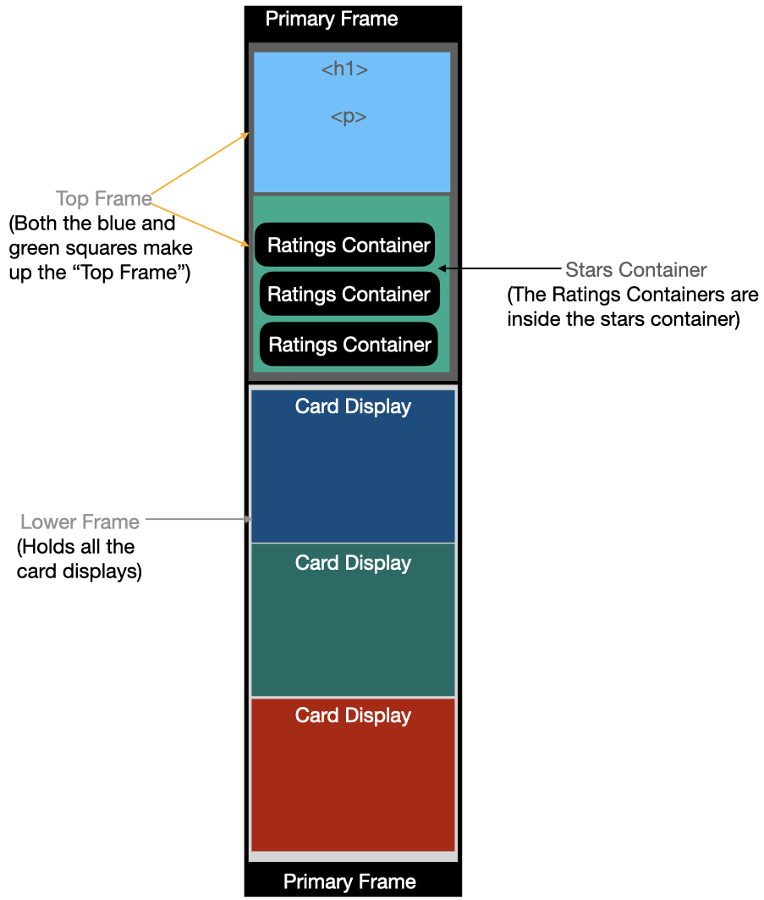
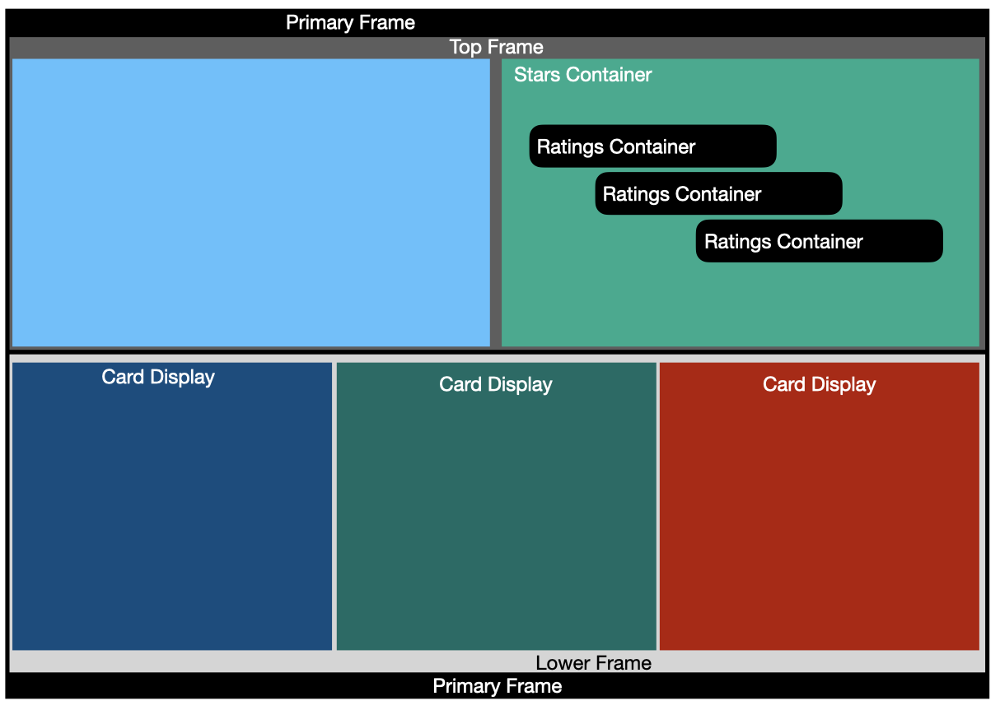

# SocialProof
This is FrontEndMentor project


# Getting Started with Create React App

This project was bootstrapped with [Create React App](https://github.com/facebook/create-react-app).

Specifically:

```
> npm create-react-app social-proof --template typescript
```

## Additional NPM installs:

This project requires the following two installs:

```
> npm install sass
> npm install react-icons
```

## General Architectural layout:

### Mobile Component layout


### Desktop Component layout


From the project directory, to open the project in a local browser you can run:

```
> npm start
```

## Structural layout and logig:

	- src
		index.tsx //The primary react-app standard starting code
		App.tsx //Sets up the initial page and creates a flex-box to center the main UI

		- Components
			- Layout
				PrimaryFrame.tsx // The main grid container which will holds and upper and lower component. 
				LowerFrame.tsx // The grid cell which holds the cards which display the user's statements.
				TopFrame.tsx //The grid cell which holds the 10,000+ user text as well as the frames which hold the star ratings.

			- Elements
				Card.tsx //The actuall component which lays out the image and textual information of the user's statements.
				RatingsContainer.tsx  //The component which holds the stars rating and rating statement.
				StarsContainer.tsx  //This is the container component which holds and lays out all the rating elements

### Logic of the architecture

	Have the components which need to be worked through to iron out the layout isolated from the content.

	Then, have the components which display data isolated from issues with the overall layout of the primary page.

	Though this architecture and the number of components may seem overkill for this project, I want to start designing as if the project were larger.  Not certain this is the right concept at this point or not.

### Question/Concerns regarding the project.

	In the /src/Components/Elements/Styles/Card.scss

	- On line 12, I'm trying to vertically center the image and the text for the user's portrait and their name.  However, nothing I seemed to do worked.
	I wound up getting it to look decent by playing around with margin and padding but I don't this that's the best way and I'm just not certain what I'm missing. 

### `npm run build`

Builds the app for production to the `build` folder.\
It correctly bundles React in production mode and optimizes the build for the best performance.

The build is minified and the filenames include the hashes.\
Your app is ready to be deployed!

See the section about [deployment](https://facebook.github.io/create-react-app/docs/deployment) for more information.

## Learn More

You can learn more in the [Create React App documentation](https://facebook.github.io/create-react-app/docs/getting-started).

To learn React, check out the [React documentation](https://reactjs.org/).


